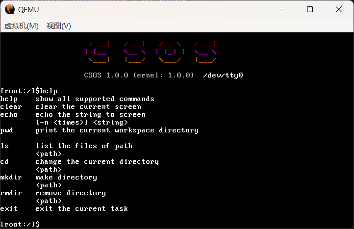
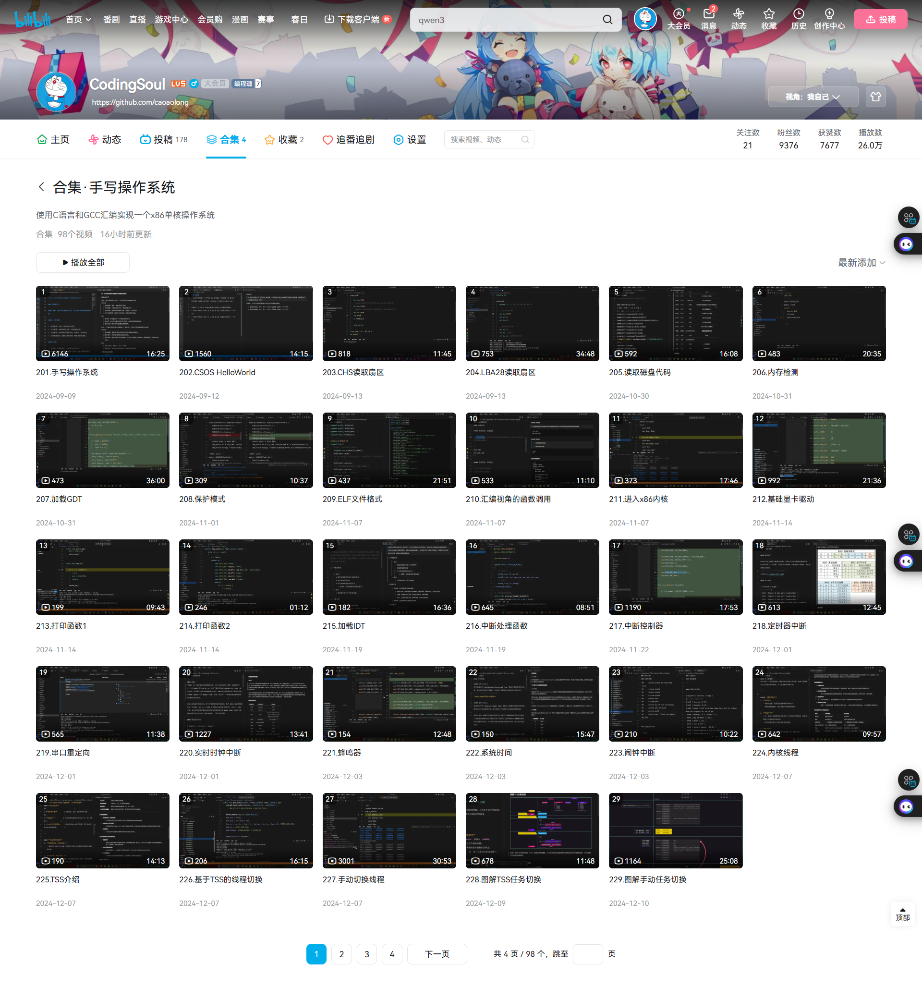
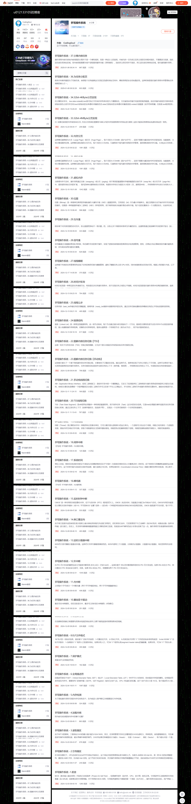

<p align="center">
    
    <br/>
    <span> Coding Soul Operating System </span>
    <br/><br/>
    <span>
        
    </span>
    <span>
        
    </span>
    <span>
        
    </span>
    <span>
        
    </span>
    <span>
        
    </span>
    <span>
        
    </span>
</p>

---

### Videos

+ B站教程 - https://space.bilibili.com/486263418/lists/4213062



### Basic & Functions

#### Basic

- [x] Boot
- [x] BootLoader
- [x] GDT
- [x] IDT
    - [x] 实时时钟
    - [x] 计数器
    - [x] 串口通信
    - [x] 实时时钟
    - [x] 蜂鸣器
    - [x] 键盘
- [x] Protection Mode
- [x] Memory Paging
    - [x] 4K内存分页
    - [x] 4M内存分页
- [x] System Call

#### Function

- [x] 内存管理
    - [x] 内存分页
    - [x] 堆栈分配
- [x] 进程管理
    - [x] 进程调度
    - [x] 进程隔离
- [x] 特权级切换
    - [x] TSS
- [x] 设备管理
    - [x] TTY设备
    - [x] 磁盘设备
- [x] 文件系统
    - [x] FAT16文件系统
    - [x] DEV虚拟文件系统
- [x] Shell程序
    - [x] ANSI转义序列
    - [x] 简易Shell解析器

---

### Usage

#### 重新全量编译

```shell
make all
```

#### 使用Bochsdbg运行
> 目前只在实模式可以在bochs中运行
```shell
make bochs
```

#### 使用Qemu运行

```shell
make qemu
```

#### 创建磁盘
> make master.img
```shell
PS D:\project\csos-teach> bximage
========================================================================
                                bximage
  Disk Image Creation / Conversion / Resize and Commit Tool for Bochs
         $Id: bximage.cc 14091 2021-01-30 17:37:42Z sshwarts $
========================================================================

1. Create new floppy or hard disk image
2. Convert hard disk image to other format (mode)
3. Resize hard disk image
4. Commit 'undoable' redolog to base image
5. Disk image info

0. Quit

Please choose one [0] 1

Create image

Do you want to create a floppy disk image or a hard disk image?
Please type hd or fd. [hd] hd

What kind of image should I create?
Please type flat, sparse, growing, vpc or vmware4. [flat] flat

Choose the size of hard disk sectors.
Please type 512, 1024 or 4096. [512] 512

Enter the hard disk size in megabytes, between 10 and 8257535
[10] 32

What should be the name of the image?
[c.img] master.img  

Creating hard disk image 'test.img' with CHS=65/16/63 (sector size = 512)

The following line should appear in your bochsrc:
  ata0-master: type=disk, path="test.img", mode=flat
(The line is stored in your windows clipboard, use CTRL-V to paste)

Press any key to continue
```

### Links

+ Coding Soul Documents - https://github.com/caoaolong/coding-soul-docs

+ OSDev Wiki - https://wiki.osdev.org/Expanded_Main_Page

### Others

+ CSDN博客 - https://blog.csdn.net/u012133105/category_12847536.html

    

### About me

+ 个人邮箱 - eason105cc@163.com