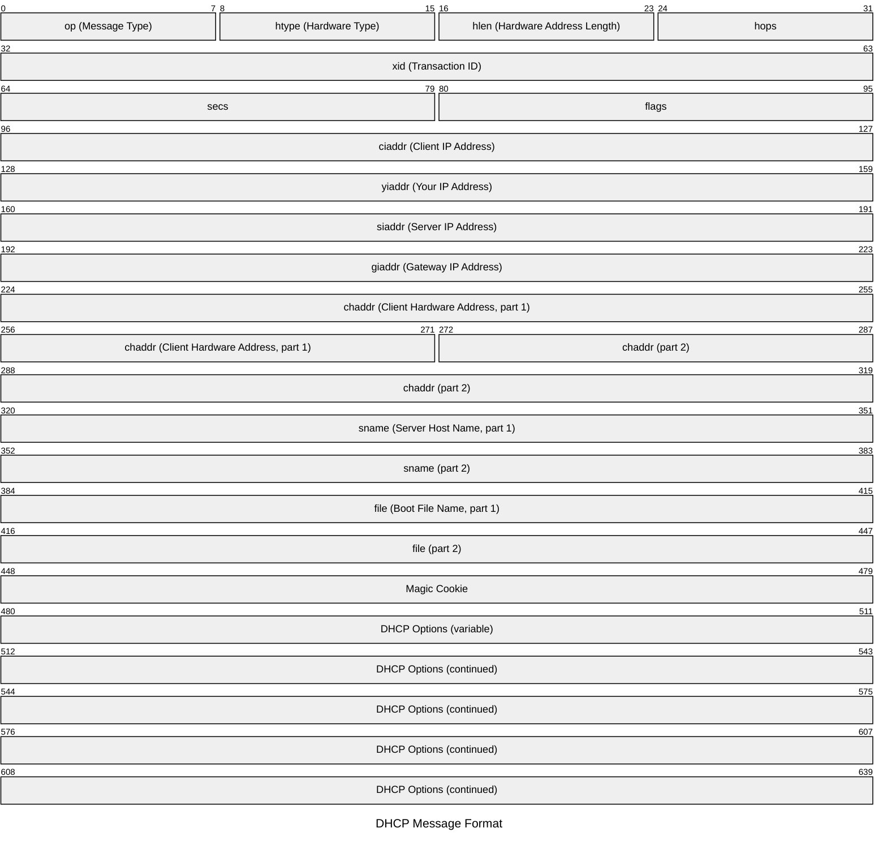

```mermaid
packet-beta
title DHCP Message Format
0-7: "op (Message Type)"
8-15: "htype (Hardware Type)"
16-23: "hlen (Hardware Address Length)"
24-31: "hops"
32-63: "xid (Transaction ID)"
64-79: "secs"
80-95: "flags"
96-127: "ciaddr (Client IP Address)"
128-159: "yiaddr (Your IP Address)"
160-191: "siaddr (Server IP Address)"
192-223: "giaddr (Gateway IP Address)"
224-271: "chaddr (Client Hardware Address, part 1)"
272-319: "chaddr (part 2)"
320-351: "sname (Server Host Name, part 1)"
352-383: "sname (part 2)"
384-415: "file (Boot File Name, part 1)"
416-447: "file (part 2)"
448-479: "Magic Cookie"
480-511: "DHCP Options (variable)"
512-543: "DHCP Options (continued)"
544-575: "DHCP Options (continued)"
576-607: "DHCP Options (continued)"
608-639: "DHCP Options (continued)"
```